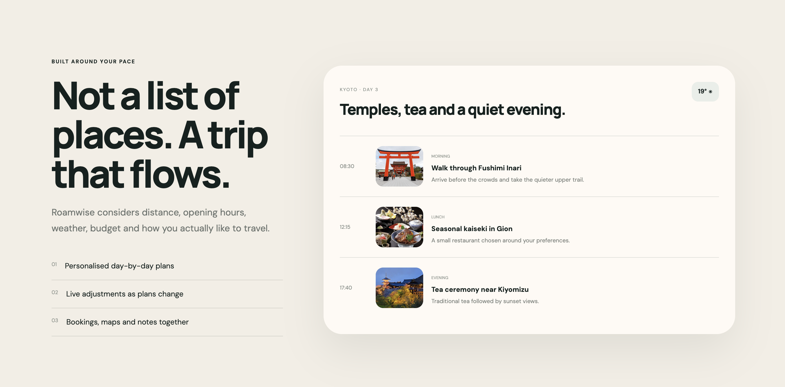
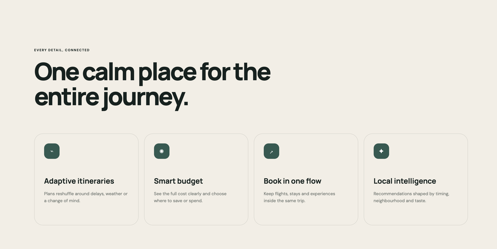
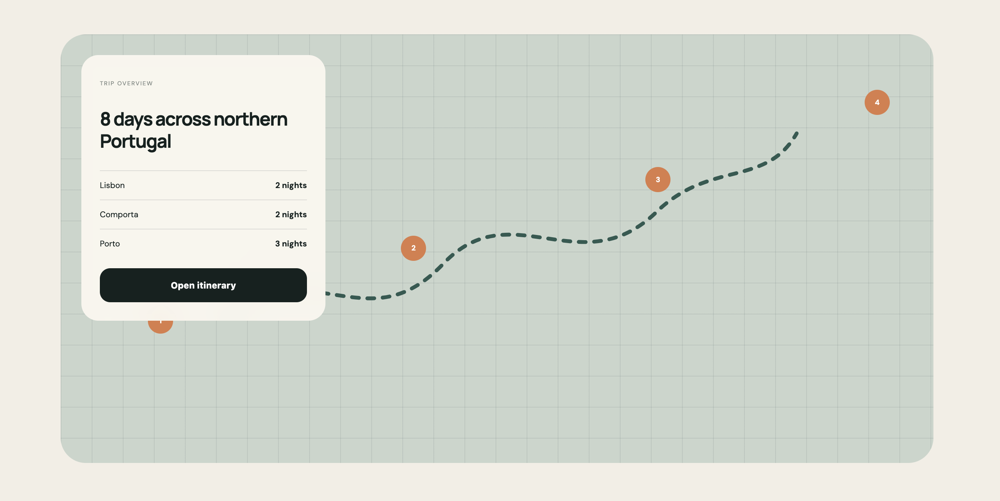

# Roamwise — AI Travel Planner

**Built by [North of Nine Studio](mailto:victoriaxgf@outlook.com)**

A fully custom, high-conversion landing page showing what a modern web product looks like when design and engineering are done right. No templates. No page builders. Every pixel and every line of code written from scratch.

**[→ View live site](https://victoriaest1.github.io/roamwise_ai_travel/)** · **[GitHub repo](https://github.com/victoriaest1/roamwise_ai_travel)**

---

## Screenshots

 

 

 

 

---

## What Was Built

A single-page product website for an AI travel planning concept — the kind of landing page a funded startup would pay an agency $15,000 for. Built independently, delivered at a fraction of that cost.

The page takes a visitor from first impression to conversion across six carefully crafted sections:

**Hero** — A full-viewport opening with a floating search widget. The headline, layout, and spacing are calibrated to communicate product value in under three seconds.

**Itinerary Preview** — A live-looking UI card showing a day-by-day trip plan. Real photography, real content, designed to make the product feel tangible before a single line of backend code exists.

**Destinations** — A responsive photo grid with three featured destinations. Large format on desktop, stacked cleanly on mobile. Every image crops and scales automatically.

**Features** — Four benefit cards communicating the product's core value props in plain language.

**Map & Route Visualiser** — A custom-built SVG route map with animated waypoints and a floating itinerary panel — the kind of detail that makes a demo feel like a real product.

**Testimonials + Stats** — Social proof section with a pull quote, ratings, and usage numbers. Structured to build trust before the final ask.

**Call to Action** — A full-width conversion section with an interactive input that responds on submit.

---

## The Standard of Work

Every decision here was made intentionally:

- Smooth scroll-reveal animations throughout — elements enter as you reach them, never before
- Typography that scales fluidly from phone to 4K monitor without a single media query breakpoint for font sizes
- A complete design system — four colour tokens drive the entire palette; changing the brand colour is a one-line edit
- Responsive across every viewport: desktop, tablet, mobile — tested and precise at each size
- Page weight under 20KB of code — fast on any connection, anywhere in the world
- Clean, semantic HTML that search engines can read and screen readers can navigate

---

## This Is a Concept — Your Business Is the Real Brief

Roamwise is a demonstration project. The real value isn't the travel theme — it's the quality, the craft, and the speed of delivery.

If you're a founder, brand, or business that needs a web presence at this level, this is what working with North of Nine Studio looks like.

**[Get in touch →](mailto:victoriaxgf@outlook.com)**

---

*North of Nine Studio · Available for freelance contracts · Fullstack web development · Design-led, UX/UI, performance-first builds*
